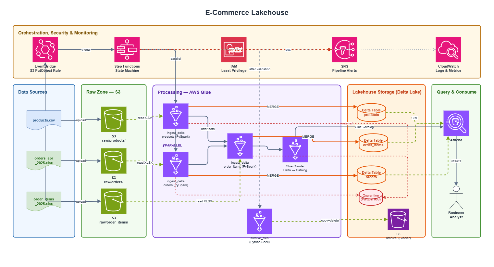

# E-Commerce Lakehouse — Delta Lake on AWS

A production-grade batch ETL pipeline that ingests CSV/XLSX e-commerce data from S3, validates and deduplicates records using AWS Glue PySpark with Delta Lake, and exposes clean data through Amazon Athena. Orchestrated by Step Functions; infrastructure is provisioned with Terraform.

## Overview

| Component | Technology |
|---|---|
| Ingestion | AWS Glue 5.0 (PySpark, Spark 3.5, Python 3.11) |
| Archival | AWS Lambda (`archive-files`) |
| Storage | Delta Lake on S3 (`lakehouse-dwh/`) |
| Orchestration | AWS Step Functions (**Standard** workflow) |
| Triggering | S3 → EventBridge → SQS → Lambda (debounced) → Step Functions |
| Query Engine | Amazon Athena (workgroup + Glue Data Catalog) |
| Alerting | Amazon SNS |
| Monitoring | Amazon CloudWatch |
| IaC | Terraform ≥ 1.5 · AWS provider ~> 6.0 |
| CI/CD | GitHub Actions (OIDC, main branch) |

**Data scale**: ~1 K products · ~500 orders/month · ~2,768 order items/month.

## Architecture



**Pipeline flow**:

1. Source files land in `s3://<bucket>/raw/<dataset>/`
2. S3 `ObjectCreated` → **EventBridge** → **SQS** (debounce queue)
3. **Lambda** (`start-pipeline`, concurrency = 1) starts **one** Step Functions execution if none is running; derives `order_month` from filenames
4. Step Functions runs **products** and **orders** Glue jobs in **parallel**, then **order_items**
5. Each Glue job reads raw files, validates, quarantines rejects, MERGE-upserts into Delta tables under `lakehouse-dwh/`, and registers tables in the Glue catalog
6. **Athena** smoke query confirms row counts across all three tables
7. **Lambda** (`archive-files`) copies raw files to `archived/` and deletes originals
8. On failure, **SNS** alert is published; Step Functions error logs go to **CloudWatch**

## Prerequisites

| Tool | Version |
|---|---|
| Python | ≥ 3.11 (Glue runtime); 3.12 for local dev |
| Terraform | ≥ 1.5 (tested with 1.15.x) |
| AWS CLI | ≥ 2.x |
| make | GNU-compatible |

## Project Structure

```text
ecommerce-lakehouse/
├── src/
│   ├── lambda_functions/
│   │   ├── start_pipeline.py
│   │   └── archive_files.py
│   ├── glue_jobs/
│   │   └── ingest_delta.py
│   ├── step_functions/
│   │   └── state_machine.asl.json
│   └── utils/
├── tests/
│   ├── unit/
│   └── integration/
├── terraform/
│   ├── main/                       # Root module (single environment)
│   └── modules/                    # s3 · iam · glue · athena · step_functions
├── .github/workflows/
│   ├── ci.yml                      # PRs to main
│   └── cd.yml                      # Push to main
├── scripts/
│   ├── upload_sample_data.py
│   ├── athena_queries.sql
│   ├── github-actions-trust-policy.json
│   └── github-actions-deploy-policy.json
├── data/                           # Sample source files
├── Makefile
└── README.md
```

## One-Time Bootstrap (AWS CLI)

These resources are **not** managed by Terraform (chicken-and-egg for remote state and CI identity).

### 1. Terraform remote state

```bash
export AWS_REGION=eu-central-1
export PROJECT=ecommerce-lakehouse
export TF_STATE_BUCKET="${PROJECT}-tfstate"

# State bucket (eu-central-1)
aws s3api create-bucket \
  --bucket "${TF_STATE_BUCKET}" \
  --region "${AWS_REGION}" \
  --create-bucket-configuration LocationConstraint="${AWS_REGION}"

aws s3api put-bucket-versioning \
  --bucket "${TF_STATE_BUCKET}" \
  --versioning-configuration Status=Enabled

aws s3api put-bucket-encryption \
  --bucket "${TF_STATE_BUCKET}" \
  --server-side-encryption-configuration \
  '{"Rules":[{"ApplyServerSideEncryptionByDefault":{"SSEAlgorithm":"AES256"}}]}'

aws s3api put-public-access-block \
  --bucket "${TF_STATE_BUCKET}" \
  --public-access-block-configuration \
  BlockPublicAcls=true,IgnorePublicAcls=true,BlockPublicPolicy=true,RestrictPublicBuckets=true
```

### 2. GitHub OIDC provider (once per AWS account)

```bash
aws iam create-open-id-connect-provider \
  --url https://token.actions.githubusercontent.com \
  --client-id-list sts.amazonaws.com \
  --thumbprint-list 6938fd4d98bab03fa02137a08d14e39eff254b61
```

### 3. GitHub Actions deploy role

Policy templates live in `scripts/`. Replace `GITHUB_ORG`, `GITHUB_REPO`, and `LAKEHOUSE_BUCKET` with your values (`PROJECT` and `TF_STATE_BUCKET` are set from section 1).

```bash
export GITHUB_ORG=your-org
export GITHUB_REPO=ecommerce-lakehouse
export LAKEHOUSE_BUCKET=your-unique-lakehouse-bucket
export ACCOUNT_ID=$(aws sts get-caller-identity --query Account --output text)

# Trust policy (OIDC) — placeholders substituted via sed
sed -e "s/ACCOUNT_ID/${ACCOUNT_ID}/g" \
    -e "s/GITHUB_ORG/${GITHUB_ORG}/g" \
    -e "s/GITHUB_REPO/${GITHUB_REPO}/g" \
    scripts/github-actions-trust-policy.json > /tmp/github-trust.json

aws iam create-role \
  --role-name "${PROJECT}-github-actions" \
  --assume-role-policy-document file:///tmp/github-trust.json

# Least-privilege deploy policy scoped to lakehouse + tfstate buckets and PROJECT-* resources
sed -e "s/ACCOUNT_ID/${ACCOUNT_ID}/g" \
    -e "s/PROJECT/${PROJECT}/g" \
    -e "s/LAKEHOUSE_BUCKET/${LAKEHOUSE_BUCKET}/g" \
    -e "s/TF_STATE_BUCKET/${TF_STATE_BUCKET}/g" \
    -e "s/AWS_REGION/${AWS_REGION}/g" \
    scripts/github-actions-deploy-policy.json > /tmp/github-deploy.json

aws iam put-role-policy \
  --role-name "${PROJECT}-github-actions" \
  --policy-name "${PROJECT}-github-actions-deploy" \
  --policy-document file:///tmp/github-deploy.json
```

Trust policy subjects:

| Subject | Used by |
|---|---|
| `ref:refs/heads/main` | CD workflow on push to `main` |
| `environment:production` | CD `deploy` job (manual approval gate) |
| `pull_request` | CI workflow on PRs to `main` |

To update an existing role, use `aws iam update-assume-role-policy` and `aws iam put-role-policy` with the same `sed` commands.

### 4. GitHub repository configuration

Configure secrets and variables on the GitHub **`production`** environment (Settings → Environments → **production**). Both CD `plan` and `deploy` jobs use that environment, so `TF_STATE_BUCKET`, `LAKEHOUSE_BUCKET`, `TF_PROJECT`, and `AWS_REGION` must be set there.

| Name | Type | Where | Value |
|---|---|---|---|
| `AWS_ROLE_ARN` | Secret | `production` environment | `arn:aws:iam::<ACCOUNT_ID>:role/PROJECT-github-actions` |
| `ALERT_EMAIL` | Secret | `production` environment | SNS alert email |
| `AWS_REGION` | Variable | `production` environment | e.g. `eu-central-1` |
| `TF_STATE_BUCKET` | Variable | `production` environment | `PROJECT-tfstate` |
| `TF_PROJECT` | Variable | `production` environment | `PROJECT` |
| `LAKEHOUSE_BUCKET` | Variable | `production` environment | Your lakehouse bucket name |

## Quick Start

```bash
git clone https://github.com/manaf-dev/ecommerce-lakehouse.git
cd ecommerce-lakehouse
make install

make lint
make test

make build-utils-zip
make verify-zip

cp terraform/main/terraform.tfvars.example terraform/main/terraform.tfvars
# Edit terraform.tfvars

make tf-validate

# First deploy (upload utils.zip, then apply)
export LAKEHOUSE_BUCKET=<your-bucket>
aws s3 cp dist/utils.zip "s3://${LAKEHOUSE_BUCKET}/scripts/utils.zip"

terraform -chdir=terraform/main init \
  -backend-config="bucket=<tfstate-bucket>" \
  -backend-config="region=<region>"

terraform -chdir=terraform/main apply

# Upload sample data (triggers pipeline via EventBridge after ~30s debounce)
export LAKEHOUSE_BUCKET=<your-bucket>
make upload-data
```

## Makefile Targets

| Target | Description |
|---|---|
| `make install` | Install package + dev dependencies |
| `make lint` | Ruff check + format check |
| `make test` | Unit + integration tests (≥ 80 % coverage) |
| `make build-utils-zip` | Package `src/utils/` for Glue `--extra-py-files` |
| `make upload-data` | Upload `data/` sample files to S3 raw zone |
| `make tf-validate` | `terraform validate` |
| `make tf-plan` | `terraform plan` |

## S3 Zone Layout

```text
s3://<bucket>/
├── raw/              # Landing zone
├── lakehouse-dwh/    # Delta tables (products, orders, order_items)
├── quarantine/       # Rejected rows (90-day lifecycle)
├── archived/         # Processed source files (Glacier after 365 days)
├── athena-results/   # Athena query output
├── scripts/          # Glue scripts + utils.zip
└── temp/             # Glue scratch
```

## Lakehouse Tables

Glue database: **`lakehouse_dwh`**

| Table | Primary Key | Partition | Format |
|---|---|---|---|
| `products` | `product_id` | unpartitioned | Delta |
| `orders` | `order_id` | `order_month` | Delta |
| `order_items` | `id` | `order_month` | Delta |

## CI/CD

| Workflow | Trigger | Actions |
|---|---|---|
| **CI** | PR to `main` | Lint → unit + integration tests → Terraform validate |
| **CD** | Push to `main` | Test gate → manual approval on **`production`** → Terraform **plan** → **apply** saved plan |

Both `plan` and `deploy` use the GitHub **`production`** environment for secrets/variables. Configure required reviewers on that environment so `terraform plan` only runs after manual approval; `deploy` reuses the same approval for the workflow run.

Glue job scripts are deployed by Terraform from the repository on each apply. `utils.zip` is uploaded after apply (skipped pre-plan on first deploy when the lakehouse bucket does not exist yet).

All AWS resources receive default tags via the provider: `Project`, `ManagedBy=terraform`, `Environment=production`.

## Troubleshooting

| Symptom | Where to look |
|---|---|
| CD `terraform apply` 403 on tfstate bucket | `plan` and `deploy` used different backends — ensure both jobs use `production` environment variables for `TF_STATE_BUCKET` |
| Pipeline not starting | CloudWatch `/aws/lambda/<project>-start-pipeline`; SQS queue depth |
| Step Functions failed | Step Functions execution history; `/aws/states/<project>-pipeline` |
| Glue job error | `/aws-glue/jobs/output` and `/aws-glue/jobs/error` |
| Rejected rows | `s3://<bucket>/quarantine/<dataset>/` |
| Athena scans too much | Add `WHERE order_month = 'YYYY-MM'` on partitioned tables |

